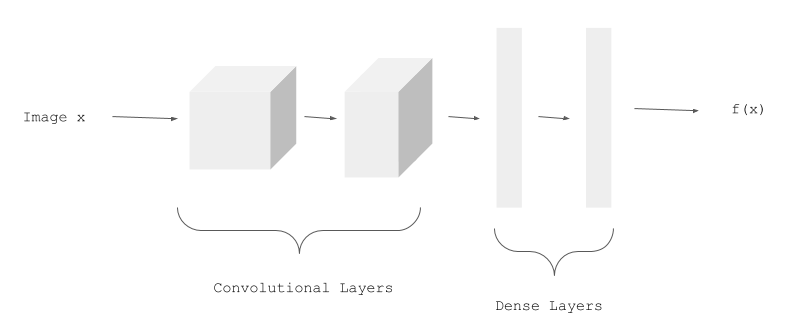
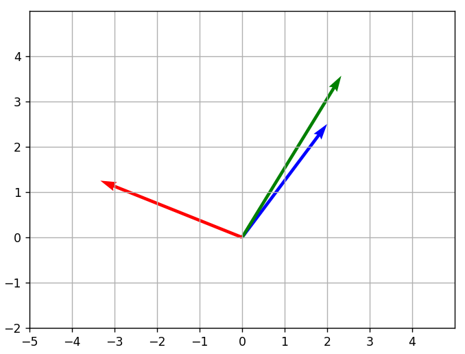
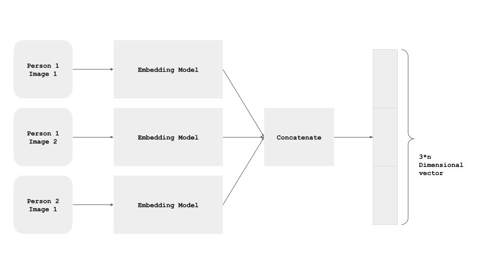

# Siamese-Network-with-Triplet-Loss
Building and training siamese network with triplet loss using Keras with Tensorflow 2.0

## Overview
- Implement a Siamese Network.
- Implement a Triplet Loss Function.
- Train a Siamese Network with Triplet Loss.

## Prerequisites
- Basic programming experience in python
- Basic understanding of Tensorflow
- Working knowledge of Machine Learning and Deep Learning

## Understanding the theory 
This appraoch is taken from the popular [FaceNet](https://arxiv.org/abs/1503.03832) paper.

We have a CNN model called `EmbeddingModel`:



### Siamese networks
The basic idea in Siamese Networks is that we find similarity between inputs. We have a sample, a positive sample and a negative sample.
When we teach someone how to identify an image, the idea is to show them a similar image and an image which is different and show them this is how they are supposed to differentiate. 
"A Siamese Neural Network is a class of neural network architectures that contain two or more identical subnetworks. ‘identical’ here means, they have the same configuration with the same parameters and weights. Parameter updating is mirrored across both sub-networks."
These networks are generally used in verification systems.

We use three images for each training example:
1. `person1_image1.jpg` (Anchor Example, represented below in green)
2. `person1_image2.jpg` (Positive Example, in blue)
3. `person2_image1.jpg` (Negative Example, in red).



All the three images of an example pass through the model, and we get the three Embeddings: One for the Anchor Example, one for the Positive Example, and one for the Negative Example.



The three instances of the `EmbeddingModel` shown above are not different instances. It's the same, shared model instance - i.e. the parameters are shared, and are updated for all the three paths simultaneously

If you need a deeper insight, refer to the articles in the reference section to read more.

### Triplet Loss
A loss function that tries to pull the Embeddings of Anchor and Positive Examples closer, and tries to push the Embeddings of Anchor and Negative Examples away from each other.
It is explained with equations in the notebook


## Installing

A step by step series of examples that tell you how to get a development env running

### Step 1
Download the prerequisites from the ``` requirements.txt``` file.

``` pip install -r requirements.txt ```

### Step 2
Open ``` jupyter notebook ``` on your local host or you can use Google Colab too.

### Step 3
Follow the steps in the notebook if you want to train your own or you can simply run the notebook in this repo.


## Project Structure

### Libraries
Importing the Libraries and Helper Functions.
### Data
Importing the Data (MNIST Dataset)
Reshaping and Normalizing the Examples.
### Functions
Creating a function to plot triplets and generate triplet examples.
### Embedding Model
Creating an Embedding Model, this is a simple Neural Network.
### Siamese Network
Using the Embedding Model to create a Siamese Network.
### Triplet Loss
Implementing the Triplet Loss function and the custom loss function.
### Model Training
Creating a small test set.
Compiling the Siamese Network with Triplet Loss.
Training the Siamese Network.

## Output

